# docker

## Runtrack 01 

Job 01 :

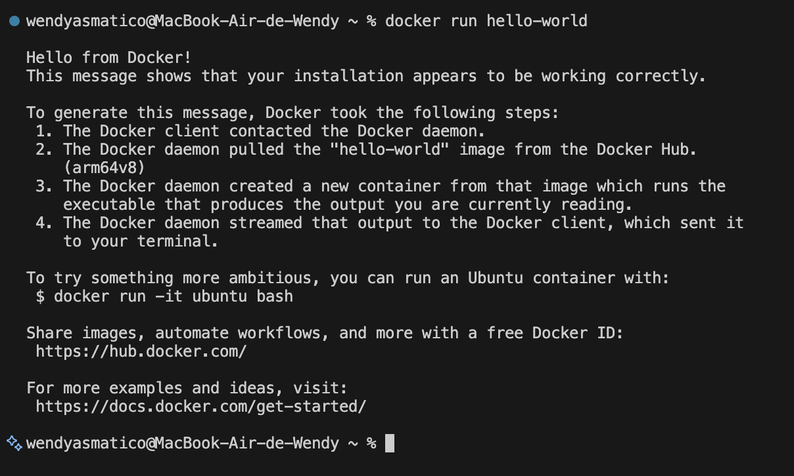

Job 02 : 

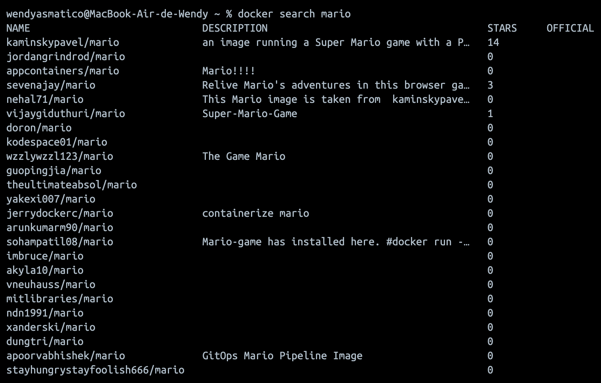

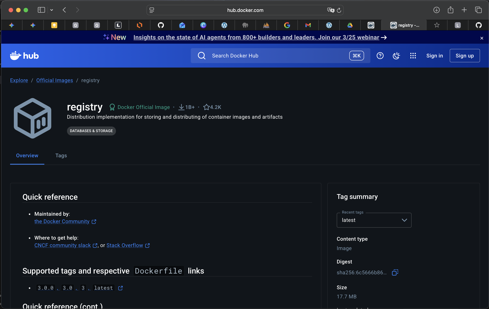

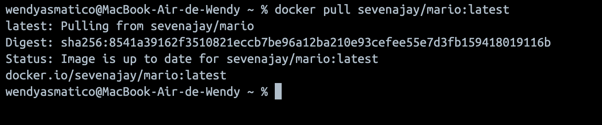

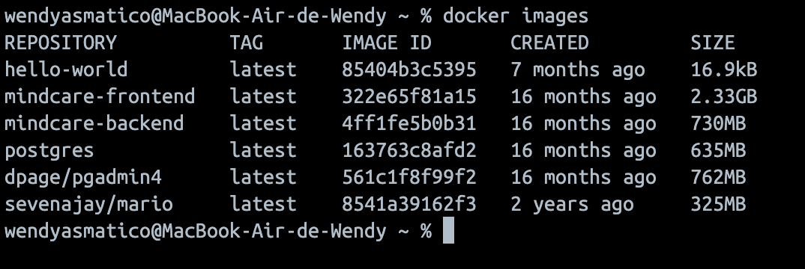

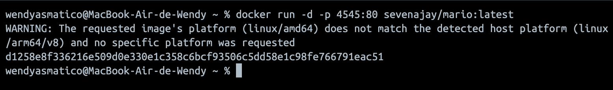

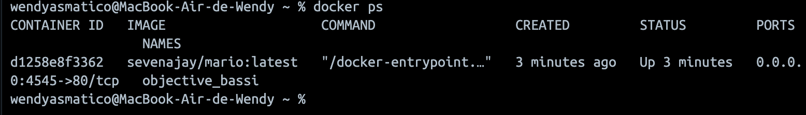

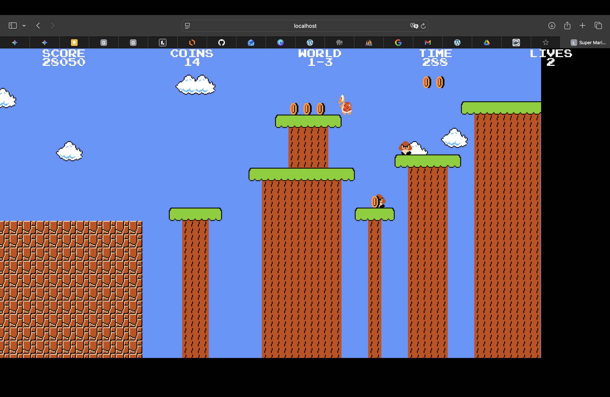

Job 04 : 

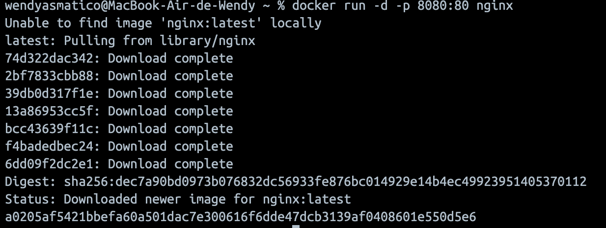

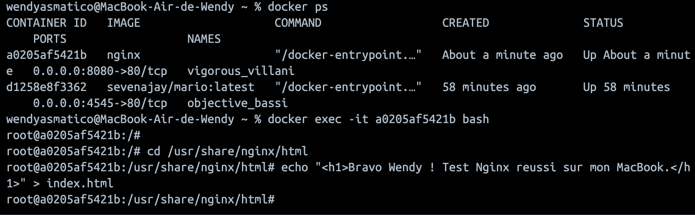

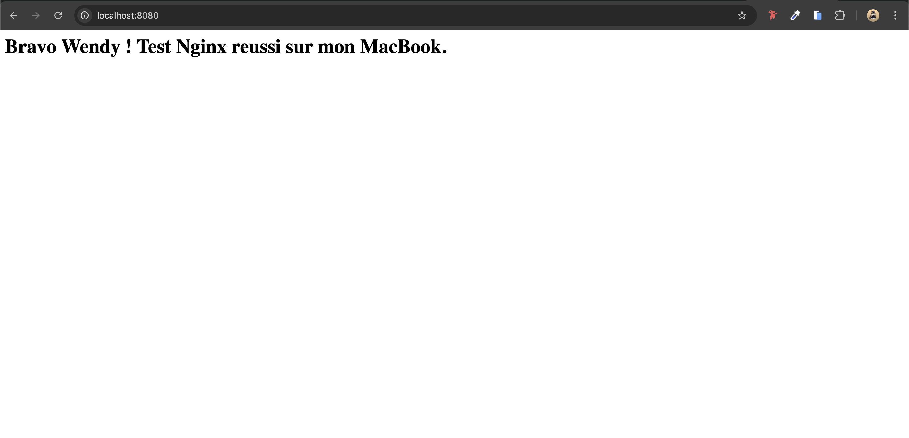

## Runtrack 02

Arrêter votre conteneur
docker stop a0205af5421b

● Supprimer votre conteneur
docker rm a0205af5421b

● Supprimer l’image Docker
docker rmi nginx

● Donner un exemple de ligne de commande pour ces actions pour supprimer :

○ Un conteneur spécifique
docker rm <ID_CONTENEUR>
○ Plusieurs conteneurs
docker rm <ID_1> <ID_2> <ID_3>

○ Tous les conteneurs arrêtés
docker container prune

○ Forcer la suppression d'un conteneur actif
docker rm -f <ID_CONTENEUR>

○ Une image spécifique
docker rmi <NOM_IMAGE>

○ Plusieurs images
docker rmi <IMAGE_1> <IMAGE_2>

○ Toutes les images inutilisées
docker image prune
○ Forcer la suppression d'une image
 docker rmi -f <ID_IMAGE>
○ Quelle erreur est présente dans les commandes
données ci-dessus, donner la correction

docker run -d -p 8080:80 nginx

## Runtrack 03 

docker run -d -p 8088:80 --name welcome-to-docker docker/welcome-to-docker

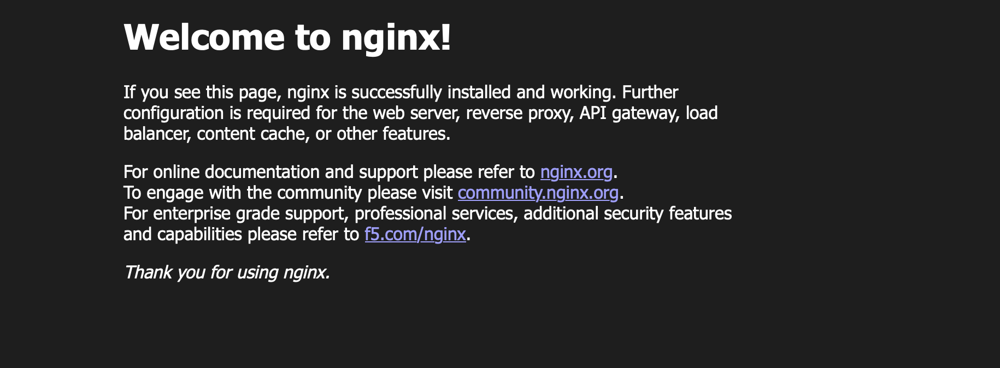

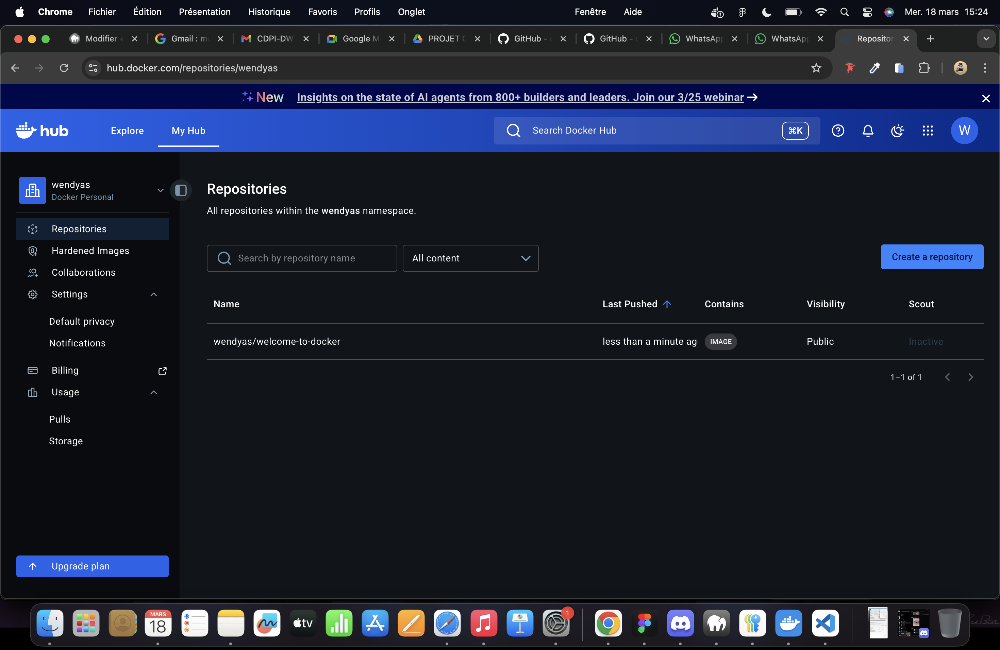

## Runtrack 05

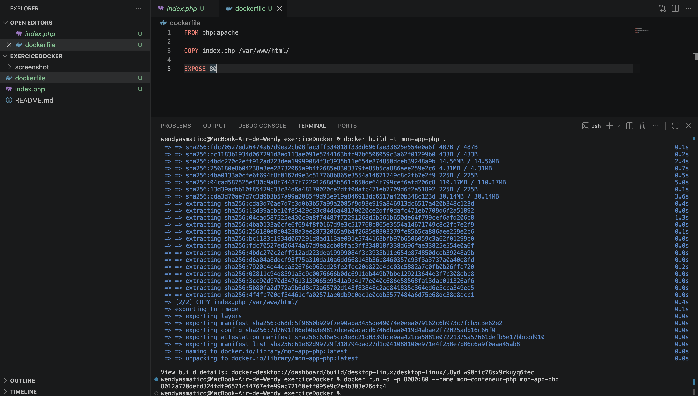

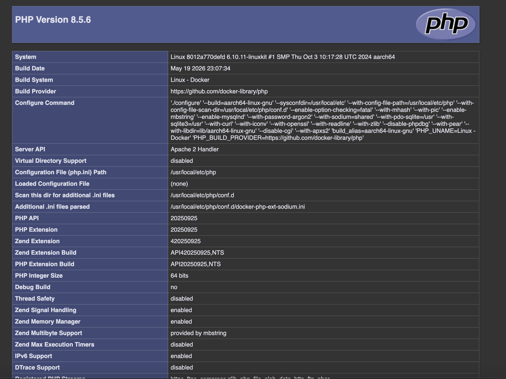

## Runtrack 06

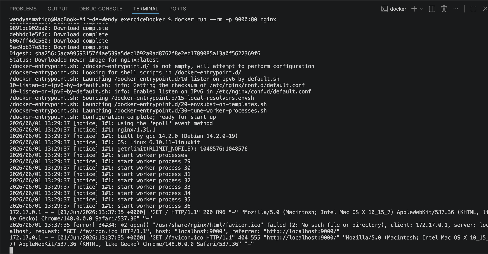

## Runtrack £07 

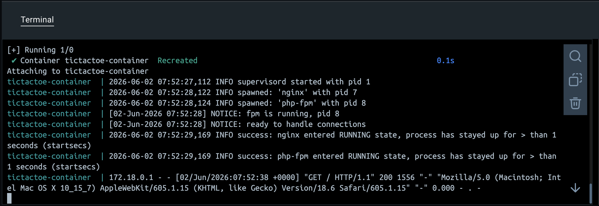

## Runtrack 08

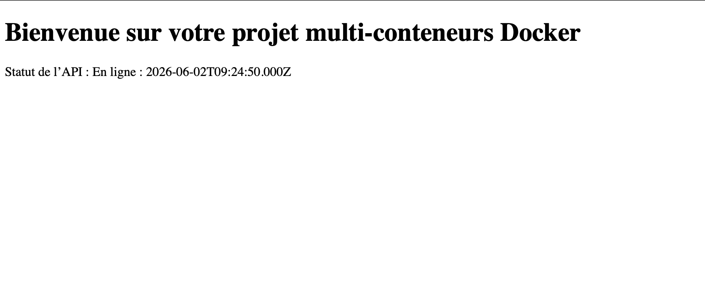

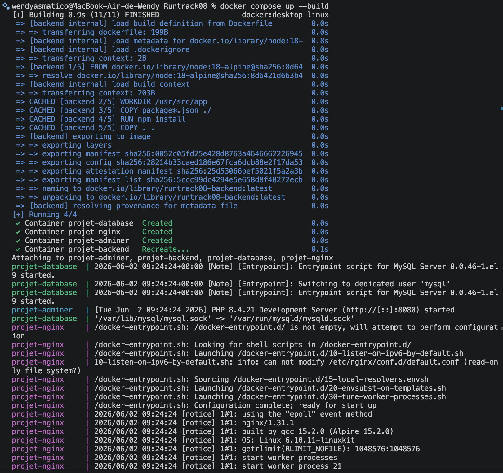

